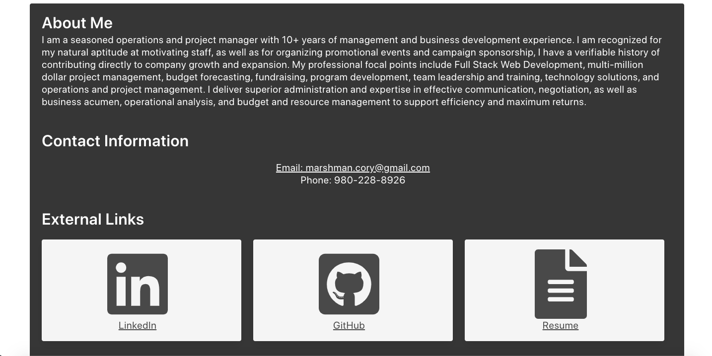
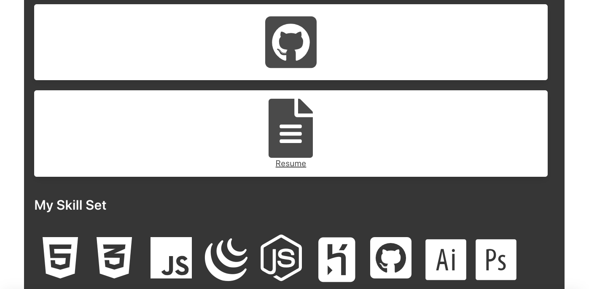
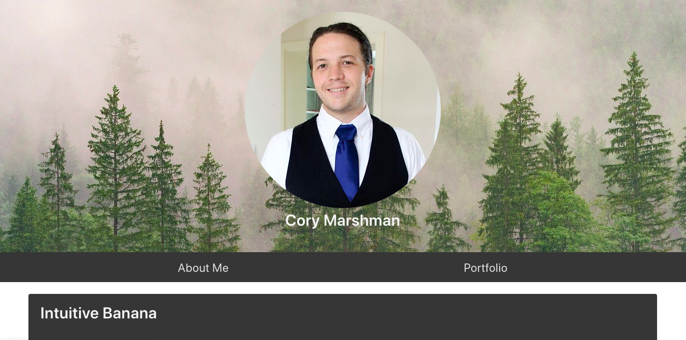
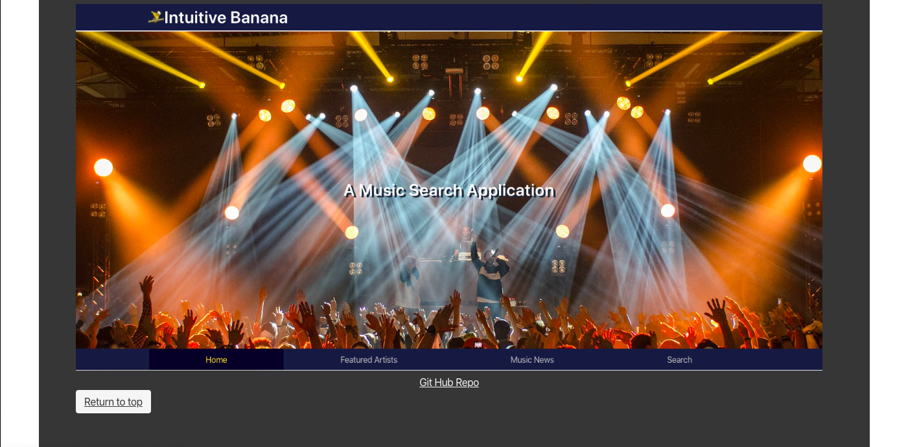

# myportfolio
A description of my current capabilities, work I've completed, resume and description about me.

## Installation

No installation is necessary.

## Purpose

The purpose of this project is to give a functional look at my front end abilities and to display previous projects to potential employeers.

## Functionality

This page displays previous work, links to github, linkedin and my resume as well as serves as a functional display of my capabilities. 

## Contributing

Bulma.io, other students and TA's 

Pull requests are welcome. However, for major chages, please open an issue first to discuss what you would like to change.

Please make sure to update tests as appropriate.

## Links

Framework: 

https://bulma.io/

Porfolio: 

Page URL: https://cmarshman.github.io/myportfolio/index.html

Github Repo:  https://github.com/cmarshman/myportfolio

Project 1: 

Page URL: https://cmarshman.github.io/IntuitiveBanana/index.html

Github Repo: https://github.com/cmarshman/IntuitiveBanana

Password Generator:

Page URL: https://cmarshman.github.io/passwordgenerator/index.html

Github Repo: https://github.com/cmarshman/passwordgenerator

Day Planner:

Page URL: https://cmarshman.github.io/day_planner/index.html

Github Repo: https://github.com/cmarshman/day_planner

Linkedin
    Profile: https://www.linkedin.com/in/cory-marshman-6aba24152/

GitHub:
    Account: https://github.com/cmarshman

## Images

Favicon +++++++++++++++++++++++++++++++++++++++++++++++++

Head Shot +++++++++++++++++++++++++++++++++++++++++++++++

About Me ++++++++++++++++++++++++++++++++++++++++++++++++

Portfolio ++++++++++++++++++++++++++++++++++++++++++++++

Resume +++++++++++++++++++++++++++++++++++++++++++++++++

## License
MIT License

Copyright (c) [2019] [Cory_Marshman]

Permission is hereby granted, free of charge, to any person obtaining a copy of this software and associated documentation files (the "Software"),to deal in the Software without restriction, including without limitation the rights to use, copy, modify, merge, publish, distribute, sublicense, and/or sell copies of the Software, and to permit persons to whom the Software is furnished to do so, subject to the following conditions: The above copyright notice and this permission notice shall be included in all copies or substantial portions of the Software.

THE SOFTWARE IS PROVIDED "AS IS", WITHOUT WARRANTY OF ANY KIND, EXPRESS OR IMPLIED, INCLUDING BUT NOT LIMITED TO THE WARRANTIES OF MERCHANTABILITY, FITNESS FOR A PARTICULAR PURPOSE AND NONINFRINGEMENT. IN NO EVENT SHALL THE AUTHORS OR COPYRIGHT HOLDERS BE LIABLE FOR ANY CLAIM, DAMAGES OR OTHER LIABILITY, WHETHER IN AN ACTION OF CONTRACT, TORT OR OTHERWISE, ARISING FROM, OUT OF OR IN CONNECTION WITH THE SOFTWARE OR THE USE OR OTHER DEALINGS IN THE SOFTWARE.